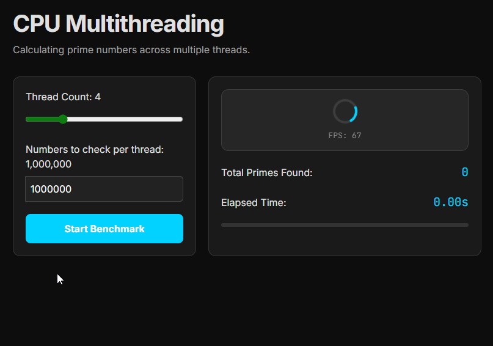

# Blazor Multi-threaded Benchmarking (.NET 10)

This project demonstrates a high-performance, multi-threaded Blazor WebAssembly application using .NET 10. It enables native C# threading and the Task Parallel Library (TPL) within the browser environment.

## Architecture & Implementation

### 1. WebAssembly Threads
The project is configured to use the `WasmEnableThreads` capability of the .NET WebAssembly runtime. This allows the instantiation of real background Web Workers that map directly to .NET Threads.

- **Configuration**: Enabled via `<WasmEnableThreads>true</WasmEnableThreads>` in `Client.csproj`.
- **Worker Pool**: Presets a pool of 4 workers using `<WasmWorkerPoolSize>4</WasmWorkerPoolSize>` to reduce startup latency.

### 2. COOP/COEP Header Injection (The Service Worker Hack)
Browser security requirements for `SharedArrayBuffer` (required for multi-threading) necessitate specific cross-origin isolation headers. Since standard local development servers often don't provide these, we utilize a Service Worker interception strategy.

- **Mechanism**: The Service Worker (`service-worker.js`) intercepts all fetch requests and appends:
  - `Cross-Origin-Embedder-Policy: require-corp`
  - `Cross-Origin-Opener-Policy: same-origin`
- **Bootstrapping**: `index.html` includes a script that detects if the page is `crossOriginIsolated`. If not, and a service worker controller is present, it forces a reload to apply the headers to the current session.

### 3. Debugger Optimization
Multithreading in Blazor WASM can cause "phantom breakpoints" or startup hitches when the .NET Debug Proxy attempts to synchronize worker threads. 

- **Fix**: The `inspectUri` has been removed from `launchSettings.json` to prevent the debug proxy from attaching to workers.
- **Filtering**: The Service Worker explicitly ignores traffic to `_framework/debug` and `_framework/blazor-hotreload` to ensure initialization messages are not modified.

## Benchmarks

The application includes several workloads designed to stress background threads while keeping the main UI thread at a consistent 144 FPS:

- **CPU Threads**: Intensive prime number calculation (`Thread` and `Task.Run`).
- **Memory Stress**: Massive array allocations and concurrent `Array.Sort` operations.
- **Parallel TPL**: Demonstrates `Parallel.For` with configurable degrees of parallelism.

## Project Structure

- `/Pages`: Benchmark implementations and the UI thread FPS visualizer.
- `/Components`: `SmoothnessVisualizer.razor` monitors the main thread responsiveness.
- `/wwwroot/service-worker.js`: The header injection engine.
- `Client.csproj`: MSBuild properties for threading and stability.

## How to Run

1. Navigate to `src/Client`.
2. Execute `dotnet run`.
3. Open the browser and ensure the Service Worker is active.
4. **Note**: If headers are not applying, unregister the Service Worker in DevTools and perform a Hard Refresh (Ctrl+F5).

## Requirements

- .NET 10 SDK or higher.
- A modern browser with `SharedArrayBuffer` support (Chrome, Edge, Firefox).
